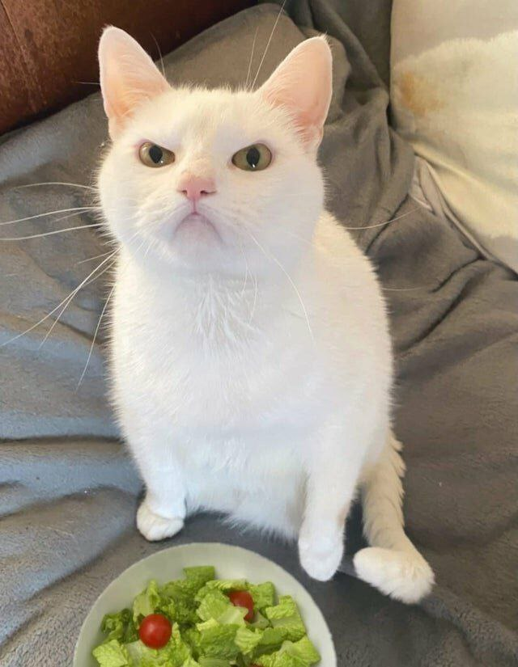
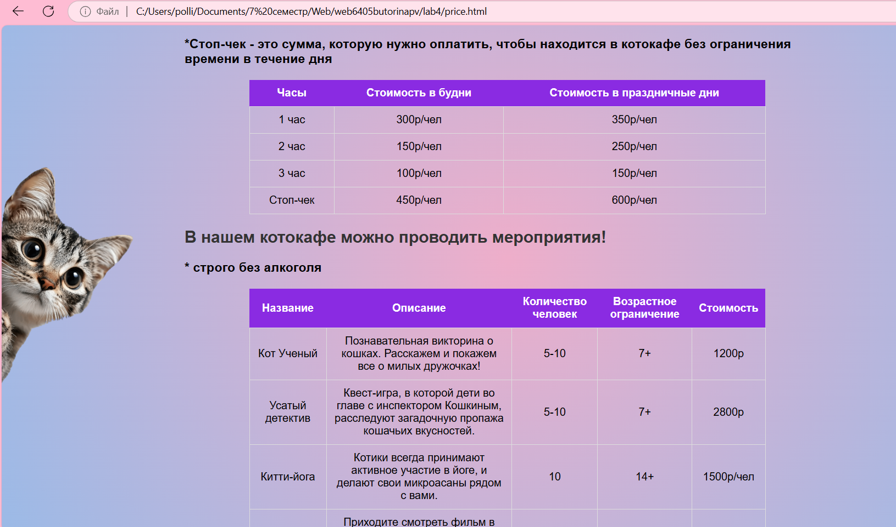

- Буторина Полина Владимировна 6405-010302D
- Научный руководитель: Гошин Е.В.
- Тема диплома: "Исследование методов однокадрового сверхразрешения"

> Запомни, а то забудешь...

## ЛР 4:
- Ранее верстка была выполнена с помощью свойства flex.
- Добавлена анимация на страницу "Услуги" (price.html).
- Добавлена новая страница "Мероприятия" (event.html), верстка выполнена с помощью свойства grid.
- Добавлена форма, открывающаяся по клику кнопки "Заявка на киттика", которая помогает выбрать котика, которого пользователь хочет приютить. В форме есть проверки на некорректно введенные данные пользователем. Реализована отправка POST-запроса на сервер по нажатию кнопки "Отправить". Если данные введены корректно, форма отправляется, пользователь получает сообщение: " Ваши данные приняты, мы с Вами свяжемся в ближайшее время".
- Вторая таблица на странице "Услуги", содержащая услуги Китти-клуба и цены, заполняется динамически.

